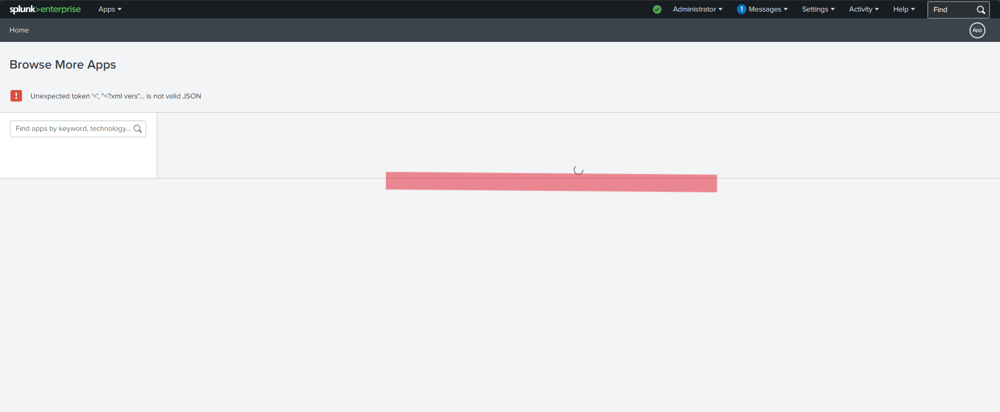

# meterpreter-attack-detection-lab

### Project Overview

This project simulates a real-world attack scenario and demonstrates how endpoint telemetry can be used to detect and investigate malicious activity using a Security Information and Event Management (SIEM) platform.

In this lab, an attack was simulated using a Meterpreter reverse TCP payload generated from Kali Linux. The payload was executed on a Windows virtual machine, after which system activity was monitored and investigated using Sysmon logs ingested into Splunk.

The goal of this project was to demonstrate the SOC investigation workflow, including identifying indicators of compromise, correlating process activity, and tracing attacker commands executed on the compromised host.

### Lab Environment

Two virtual machines were used:

| Machine    | Role                                  |
| ---------- | ------------------------------------- |
| Kali Linux | Attacker machine                      |
| Windows VM | Victim machine with Sysmon and Splunk |

Network option for both these virtual machines was set to internal network in VirtualBox to create an isolated network.

### Skills Learned

-Simulating attacks using Metasploit and Meterpreter reverse TCP payloads
-Hosting and delivering payloads using a Python HTTP server
-Collecting endpoint telemetry using Sysmon
-Ingesting and analyzing logs in Splunk
-Investigating suspicious activity using queries
-Tracing attacker commands executed through a reverse shell
-Understanding the SOC workflow from attack simulation to detection and investigation

### Tools Used

| Tool                 | Purpose                                             |
| -------------------- | --------------------------------------------------- |
| Kali Linux           | Attack simulation machine                           |
| Metasploit Framework | Payload generation and exploitation                 |
| Python               | Hosting a simple HTTP server to deliver the payload |
| Windows VM           | Target machine                                      |
| Sysmon               | Endpoint telemetry and process logging              |
| Splunk               | Log ingestion and investigation                     |

## Steps
1. The first step of the project is to setup both the virtual machines, I used a kali linux vm and another windows 10 vm inside virtual box. It's settings has to be adjusted so that the network is set to internal network rather than NAT. Both the virtual machines should be configured to be in the same internal network.
3. When this is done we can power up both the machines
4. To setup the windows machine further we have to make sure that splunk and sysmon is installed in windows.
5. Sysmon needs to be running the olaf configuration (It is a configuration file created by OlafHartong.) You will find a lot of videos on youtube that will guide you through it. You can download the config file from <a href="https://github.com/olafhartong/sysmon-modular/blob/master/sysmonconfig.xml">here</a>
6. You also need to install the sysmon-add-on for splunk into your splunk for it to be able to parse sysmon logs. When I tried to do it, the store within splunk wouldn't load and then I had to find an alternate way and ended up downloading the add on file seperately and then adding it to sysmon directly from my machine. 

  

  <em>Figure 1: Reverse TCP connection established between the victim and attacker machine.</em>

7. Then the first step is to take note of IP addresses of both the machines. You can use the commands `ifconfig` and `ipconfig` for this in linux and windows terminals respectively. In my setup the two ip addresses was `192.168.20.11` for the kali machine and `192.168.20.10` for windows machine.
8. Next we perform a simple network enumeration of the windows machine using nmap from the kali machine to identify the open ports in the windows machine and we take note of the obtained results.
9. 

drag & drop screenshots here or use imgur and reference them using imgsrc

Every screenshot should have some text explaining what the screenshot is about.

Example below.

*Ref 1: Network Diagram*
